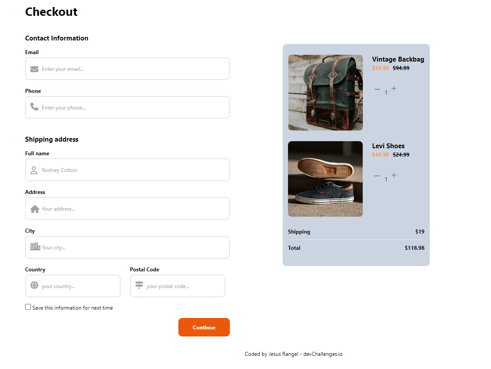

<!-- Please update value in the {}  -->

<h1 align="center">{Checkout Page By jerangel1}</h1>

<div align="center">
   Solution for a challenge from  <a href="http://devchallenges.io" target="_blank">Devchallenges.io</a>.
</div>

<div align="center">
  <h3>
    <a href="https://{127.0.0.1:5500/index.html}">
      Demo
    </a>
    <span> | </span>
    <a href="https://{your-url-to-the-solution}">
      Solution
    </a>
    <span> | </span>
    <a href="https://devchallenges.io/challenges/0J1NxxGhOUYVqihwegfO">
      Challenge
    </a>
  </h3>
</div>

<!-- TABLE OF CONTENTS -->

## Table of Contents

- [Overview](#overview)
  - [Built With](#built-with)
- [Features](#features)
- [Contact](#contact)
- [Acknowledgements](#acknowledgements)

<!-- OVERVIEW -->

## Overview



Introduce your projects by taking a screenshot or a gif. Try to tell visitors a story about your project by answering:

- Where can I see your demo?
Puedes ver la demostración del código en acción al copiarlo y ejecutarlo en un entorno de desarrollo web local o utilizando un editor en línea como CodePen o JSFiddle.
- What was your experience?
Mi experiencia en el desarrollo de esta página de checkout ha sido muy enriquecedora. He podido aplicar mis conocimientos en HTML, Tailwind CSS y JavaScript para crear una interfaz funcional y atractiva. Aprender a gestionar el carrito de compras y calcular el total me ha dado una visión más práctica de cómo implementar características importantes en una tienda en línea.
- What have you learned/improved?
Mediante este proyecto, he mejorado mis habilidades en el uso de Tailwind CSS para aplicar estilos de manera eficiente y ágil en el código HTML. También he aprendido a utilizar JavaScript para gestionar datos y la interacción del usuario, lo que ha fortalecido mi conocimiento en desarrollo frontend. Además, he aprendido a trabajar en un proyecto real y enfrentar desafíos comunes en el desarrollo web.
- Your wisdom? 
Mi sabiduría como programador junior es que nunca dejes de aprender. El ser proactivo y autodidacta es clave para crecer en la industria tecnológica. Participa en proyectos personales, colabora en comunidades de desarrollo y nunca temas enfrentar nuevos desafíos. La perseverancia y la pasión por la programación te llevarán lejos. ¡Siempre mantén tu curiosidad y mantente actualizado con las últimas tecnologías y tendencias en el mundo del desarrollo web! #ThisIsTheWay

### Built With

- [HTML](https://developer.mozilla.org/en-US/docs/Web/HTML)
- [Tailwind CSS](https://tailwindcss.com/)
- [JavaScript](https://developer.mozilla.org/en-US/docs/Web/JavaScript)

No major frameworks like React or Vue.js were used in this project. The page was created using basic web technologies such as HTML for the structure, Tailwind CSS for styling, and JavaScript for managing the shopping cart functionality.
## Features

<!-- List the features of your application or follow the template. Don't share the figma file here :) -->

This application/site was created as a submission to a [DevChallenges](https://devchallenges.io/challenges) challenge. The [challenge](https://devchallenges.io/challenges/0J1NxxGhOUYVqihwegfO) was to build an application to complete the given user stories.


## How To Use

To clone and run this application, you'll need [Git](https://git-scm.com) and [Node.js](https://nodejs.org/en/download/) (which comes with [npm](http://npmjs.com)) installed on your computer. From your command line:

```bash
# Clone this repository
$ git clone https://github.com/your-user-name/your-project-name

# Install dependencies
$ npm install

# Run the app
$ npm start
```

## Acknowledgements

<!-- This section should list any articles or add-ons/plugins that helps you to complete the project. This is optional but it will help you in the future. For exmpale -->

- [Steps to replicate a design with only HTML and CSS](https://devchallenges-blogs.web.app/how-to-replicate-design/)
- [Node.js](https://nodejs.org/)
- [Marked - a markdown parser](https://github.com/chjj/marked)

## Contact

- Linkedin [Jerangel1](https://{www.linkedin.com/in/jerangel1/})
- GitHub [@jerangel1](https://{github.com/jerangel1/checkout-Page})
- Twitter [@Jerangel1](https://{twitter.com/jerangel1})
